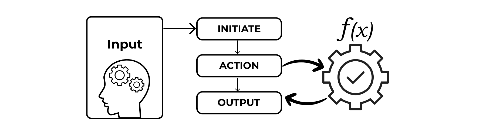

# FlowLynk - Build Smart AI Agents with Chain of Thought in Minutes



FlowLynk is a TypeScript package that simplifies building AI-powered agents with LLMs via OpenAI's SDK. It uses Chain of Thought (CoT) reasoning to break down complex problems into logical steps.

## Why FlowLynk?

- **Chain of Thought Reasoning**: Uses CoT to reason through tasks logically, step by step.
- **Universal LLM Support**: Works with OpenAI, Gemini, and other LLMs compatible with OpenAI's SDK.
- **Modular Workflows**: Define custom steps, tools, examples and prompts for tailored pipelines.
- **Robust Tool Integration**: Seamlessly incorporate external tools with input as arguments.
- **Error Resilience**: Handles API failures, tool errors, and invalid inputs gracefully.
- **Developer-Friendly**: TypeScript-ready with step-by-step execution and real-time callbacks.
- **Beginner-Friendly**: Simple error messages and TypeScript safety.
- **Clear Process**: Tracks each step for transparency and debugging.

## Installation

Install via npm:
```bash
npm install flowlynk
```

Create a `.env` file in your project root and add your LLM provider's API key:
```
GEMINI_API_KEY=your-openai-api-key-here
# OR
GEMINI_API_KEY=your-gemini-api-key-here
```

## Quick Start

Here's a simple example to create an AI agent that answers a question using Chain of Thought:

```typescript
import  createLynk  from 'flowlynk';

const lynk = createLynk({
  apiKey: process.env.GEMINI_API_KEY || '',
  model: 'gemini-2.0-flash',
  url: "https://generativelanguage.googleapis.com/v1beta/openai",
  steps: [
    { name: 'think', purpose: 'Reason about the query' },
    { name: 'explain', purpose: 'Provide the final answer' },
  ],
});

async function runLynk() {
  const { result } = await lynk.run('Why is the sky blue?',(step) => {
    console.log('Step:', step);
  });
  console.log('Result:', result);
}

runLynk();
```

This code creates an agent that thinks through the question and answers (e.g., "The sky is blue due to Rayleigh scattering..."). It demonstrates FlowLynk's CoT approach in action.

## What Can FlowLynk Automate?

FlowLynk uses Chain of Thought to automate tasks by reasoning step-by-step. Here are some examples:

- **Task Planning**: Plan a project or schedule by breaking it into steps.
- **Code Generation**: Write code files after planning the structure.
- **Data Analysis**: Analyze datasets and summarize findings.
- **Content Creation**: Draft emails or reports with structured outlines.
- **File Organization**: Sort or rename files based on logical rules.
- **Workflow Automation**: Automate repetitive tasks with clear reasoning.

## Usage Examples

### Example 1: Task Planning

This example plans a study schedule by reasoning through priorities and automating a to-do list:

```typescript
import  createLynk  from 'flowlynk';

const lynk = createLynk({
  apiKey: process.env.GEMINI_API_KEY || '',
  model: 'gemini-2.0-flash',
  url: "https://generativelanguage.googleapis.com/v1beta/openai",
  tools: {
    saveList: {
      function: async ({ content }: { content: string }) => {
        try {
          const fs = require('fs').promises;
          await fs.writeFile('todo.txt', content, 'utf8');
          return { status: 'success', message: 'To-do list saved' };
        } catch (error) {
          return { status: 'error', message: (error as Error).message };
        }
      },
      description: 'Saves a to-do list to a file',
      input: { content: 'string' },
    },
  },
  steps: [
    { name: 'analyze', purpose: 'Understand study needs' },
    { name: 'plan', purpose: 'Create a prioritized schedule' },
    { name: 'save', purpose: 'Save the schedule to a file' },
  ],
});

async function runLynk() {
  const { result } = await lynk.run('Plan a study schedule for math and history exams',(step) => {
    console.log('Step:', step);
  });
  console.log('Final Result:', result);
}

runLynk();
```

This agent analyzes the exams, plans a schedule (e.g., "Day 1: Math, Day 2: History"), and saves it to todo.txt, showing CoT reasoning and automation.

### Example 2: Code Generation

This example generates a Python script after planning its structure:

```typescript
import  createLynk  from 'flowlynk';

const lynk = createLynk({
  apiKey: process.env.GEMINI_API_KEY || '',
  model: 'gemini-2.0-flash',
  url: "https://generativelanguage.googleapis.com/v1beta/openai",
  tools: {
    writeFile: {
      function: async ({ path, content }: { path: string; content: string }) => {
        try {
          const fs = require('fs').promises;
          await fs.writeFile(path, content, 'utf8');
          return { status: 'success', message: `Wrote to ${path}` };
        } catch (error) {
          return { status: 'error', message: (error as Error).message };
        }
      },
      description: 'Writes content to a file',
      input: { path: 'string', content: 'string' },
    },
  },
  steps: [
    { name: 'analyze', purpose: 'Determine script requirements' },
    { name: 'plan', purpose: 'Outline the script structure' },
    { name: 'write', purpose: 'Write the script to a file' },
  ],
});

async function runLynk() {
  const { result } = await lynk.run('Create a Python script to calculate square roots',(step) => {
    console.log('Step:', step);
  });
  console.log('Result:', result);
}

runLynk();
```

This agent reasons about the script's needs, plans the code, and writes it to a file (e.g., script.py with math.sqrt), automating code generation with CoT.

### Example 3: Data Analysis

This example analyzes a dataset and summarizes findings, reasoning through the data first:

```typescript
import createLynk from 'flowlynk';

const lynk = createLynk({
  apiKey: process.env.GEMINI_API_KEY || '',
  model: 'gemini-2.0-flash',
  url: "https://generativelanguage.googleapis.com/v1beta/openai",
  tools: {
    saveSummary: {
      function: async ({ content }: { content: string }) => {
        try {
          const fs = require('fs').promises;
          await fs.writeFile('summary.txt', content, 'utf8');
          return { status: 'success', message: 'Summary saved' };
        } catch (error) {
          return { status: 'error', message: (error as Error).message };
        }
      },
      description: 'Saves a summary to a file',
      input: { content: 'string' },
    },
  },
  steps: [
    { name: 'analyze', purpose: 'Examine the dataset' },
    { name: 'summarize', purpose: 'Generate a summary' },
    { name: 'save', purpose: 'Save the summary' },
  ],
});

async function runLynk() {
  const { result } = await lynk.run('Analyze sales data: [100, 150, 200, 120]',(step) => {
    console.log('Step:', step);
  });
  console.log('Result:', result);
}

runLynk();
```

This agent analyzes the sales data, summarizes trends (e.g., "Average sales: 142.5"), and saves the summary to summary.txt, using CoT for reasoning.

### Advanced Example with Weather Tool

For more complex workflows, FlowLynk supports custom tools, predefined steps, and step-by-step callbacks:

```typescript
import createAgent from 'flowlynk';

const agent = createAgent({
  apiKey: process.env.GEMINI_API_KEY || '',
  model: 'gemini-2.0-flash',
  url: "https://generativelanguage.googleapis.com/v1beta/openai",
  tools: {
    getWeather: {
      function: async ({ city }: { city: string }) => ({
        city: city,
        temperature: '25°C', // Mock response
      }),
      description: 'Fetches weather data for a city',
      input: { city: 'string' },
    },
  },
  steps: [
    { name: 'plan', purpose: 'Analyze the query and plan the approach' },
    { name: 'execute', purpose: 'Execute the planned actions using tools' },
  ],
  examples: [
    {
      UserQuery: 'What\'s the weather in London?',
      Output: [
        { step: 'initiate', content: 'Analyzing query to fetch weather' },
        { step: 'action', function: 'getWeather', input: { city: 'London' } },
        { step: 'output', content: 'The temperature in London is 25°C' },
      ],
    },
  ],
});

async function runAdvancedAgent() {
  const { result, steps } = await agent.run(
    'What\'s the weather in New York?',
    (step) => console.log('Current Step:', step)
  );
  console.log('Final Result:', result);
  console.log('All Steps:', steps);
  console.log('Message Logs:', agent.messageLogs());
}

runAdvancedAgent();
```

## Configuration Options

FlowLynk accepts a configuration object with the following options:

| Option | Type | Default | Description |
|--------|------|---------|-------------|
| apiKey | string | Required | API key for the LLM provider. |
| model | string | Required | LLM model (e.g., gpt-4o). |
| tools | Record<string, Tool> | {} | Custom tools with functions, descriptions, and input schemas. |
| steps | LynkStep[] | undefined | Predefined steps for custom workflows. |
| examples | Example[] | [] | Example queries and outputs to guide the agent. |
| userSystemPrompt | string | undefined | Custom system prompt to override default behavior. |
| history | ChatCompletionMessageParam[] | [] | Message history for context-aware conversations. |
| temperature | number | null | Temperature setting for response generation. |
| maxTokens | number | null | Maximum token limit for responses. |
| url | string | undefined | Custom base URL for the LLM API (optional). |

## Features

- **Chain of Thought**: Reasons step-by-step like a human for complex problem solving.
- **Structured Workflow**: Enforces initiate → intermediate steps → output.
- **Tool Execution**: Safely runs custom tools with validated inputs and error handling.
- **Step Tracking**: Access all steps for debugging or logging.
- **Message Logs**: Retrieve conversation history with `agent.messageLogs()`.
- **Reset State**: Clear history and steps with `agent.reset()` for fresh runs.
- **Error Handling**: Automatically handles API failures, parsing errors, and tool issues with detailed feedback.


Happy building with FlowLynk!